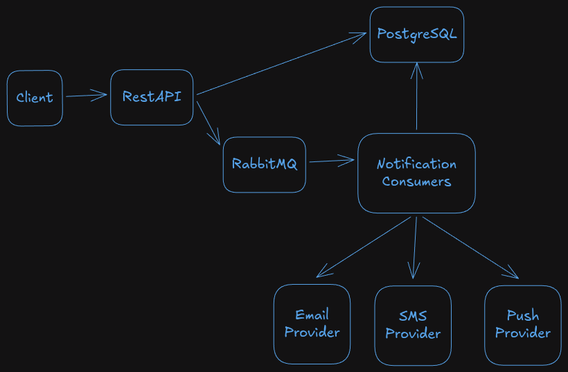

# Notification Platform

[](https://openjdk.org/)
[](https://spring.io/projects/spring-boot)
[](https://www.rabbitmq.com/)
[](https://www.postgresql.org/)
[](https://www.docker.com/)
[](https://maven.apache.org/)

> Plataforma backend assíncrona e multicanal para processamento de notificações, desenvolvida com Java 21 e Spring Boot, utilizando RabbitMQ para processamento orientado a eventos.

A **Notification Platform** foi concebida para processar notificações de forma **assíncrona, desacoplada e resiliente**, permitindo suportar diferentes canais de entrega através de uma arquitectura extensível.

O projecto explora problemas comuns de engenharia de software em sistemas distribuídos, incluindo **mensageria, processamento assíncrono, idempotência, persistência, retries, controlo de estado, desacoplamento e evolução independente dos canais de notificação**.


## High Level Design


---
# 🏗️ Arquitectura

O projecto segue princípios de:

* **Clean Architecture**
* **Hexagonal Architecture**
* **Domain-Driven Design (DDD)**
* **SOLID**
* **Dependency Inversion**
* **Separation of Concerns**
* **Ports and Adapters**
* **Strategy Pattern**
* **Event-driven processing**

A arquitectura procura manter o domínio independente de frameworks, bases de dados, brokers de mensagens e fornecedores externos.

```text
┌─────────────────────────────────────────────┐
│                  REST API                   │
│              Inbound Adapter                │
└──────────────────────┬──────────────────────┘
                       │
                       ▼
┌─────────────────────────────────────────────┐
│                Application                  │
│                                             │
│   Use Cases / Ports / Application Services  │
└──────────────────────┬──────────────────────┘
                       │
                       ▼
┌─────────────────────────────────────────────┐
│                   Domain                    │
│                                             │
│    Entities / Rules / Domain Behaviour      │
└──────────────────────┬──────────────────────┘
                       │
             ┌─────────┴──────────┐
             ▼                    ▼
┌──────────────────────┐ ┌────────────────────┐
│   PostgreSQL/JPA     │ │     RabbitMQ       │
│   Outbound Adapter   │ │  Messaging Adapter │
└──────────────────────┘ └─────────┬──────────┘
                                    │
                                    ▼
                         ┌────────────────────┐
                         │ Notification       │
                         │ Consumer           │
                         └─────────┬──────────┘
                                   │
                                   ▼
                         ┌────────────────────┐
                         │ Channel Strategy   │
                         ├────────────────────┤
                         │ Email              │
                         │ SMS                │
                         │ Push               │
                         └────────────────────┘
```

---

# 📢 Canais de notificação

Os canais são implementados utilizando o **Strategy Pattern**.

Em vez de concentrar o comportamento de todos os canais numa única implementação, cada canal possui o seu próprio processamento.

```text
NotificationChannelStrategy
          │
          ├── EmailNotificationStrategy
          │
          ├── SmsNotificationStrategy
          │
          └── PushNotificationStrategy
```

Esta abordagem facilita a evolução da plataforma.

Um novo canal pode ser introduzido através de uma nova implementação da estratégia, reduzindo o impacto no restante fluxo da aplicação.

### Canais actuais

* Email
* SMS
* Push

### Possíveis extensões

* WhatsApp
* Outros fornecedores de comunicação

---

# 🛡️ Resiliência e processamento de falhas

A entrega de notificações depende de componentes externos que podem apresentar falhas temporárias.

A plataforma possui estados explícitos para acompanhar o ciclo de processamento:

```text
PENDING
   │
   ▼
PROCESSING
   │
   ├──────────────► DELIVERED
   │
   └──────────────► RETRYING
                         │
                         ▼
                    PROCESSING
                         │
                         ├──► DELIVERED
                         │
                         └──► FAILED / DEAD_LETTER
```

Os estados actualmente suportados são:

```text
PENDING
PROCESSING
DELIVERED
RETRYING
FAILED
DEAD_LETTER
```

O controlo do estado e das tentativas permite acompanhar o processamento e tratar falhas de forma explícita.

---

# 🔁 Idempotência

Sistemas assíncronos podem receber ou processar a mesma operação mais do que uma vez.

Por isso, a plataforma utiliza uma **Idempotency Key** na criação de notificações.

A chave é representada por um UUID e possui uma restrição de unicidade na base de dados.

```text
Client
  │
  │ Idempotency-Key
  ▼
REST API
  │
  ▼
Application
  │
  ▼
PostgreSQL
  │
  └── unique idempotency_key
```

Isto permite identificar uma operação já registada e reduzir o risco de criação duplicada da mesma notificação.

---

# 🗃️ Persistência

O PostgreSQL é utilizado como base de dados principal.

A persistência utiliza:

* Spring Data JPA
* Hibernate
* PostgreSQL
* Flyway

As alterações ao schema são geridas através de migrations versionadas.

A entidade principal `Notification` mantém informações como:

* identificador;
* destinatário;
* canal;
* conteúdo;
* prioridade;
* estado;
* número de tentativas;
* idempotency key;
* timestamps;
* último erro.

O projecto também mantém o histórico das tentativas de processamento através de `notification_attempts`.

---

# 🐇 Messaging

O RabbitMQ é responsável pelo processamento assíncrono.

A arquitectura utiliza consumidores específicos para os diferentes canais:

```text
RabbitMQ
    │
    ├── Email Consumer
    │
    ├── SMS Consumer
    │
    └── Push Consumer
```

Os consumidores são responsáveis por:

* receber mensagens;
* localizar a notificação;
* actualizar o estado;
* executar a estratégia correspondente ao canal;
* registar falhas;
* controlar retries;
* encaminhar mensagens para dead-letter quando necessário.

---

# 🧪 Estratégia de testes

O projecto utiliza diferentes níveis de validação.

## Testes unitários

Os testes unitários validam componentes isoladamente, utilizando mocks quando necessário.

São utilizados para testar:

* regras de domínio;
* serviços de aplicação;
* consumidores;
* publisher RabbitMQ;
* comportamentos de sucesso;
* comportamentos de falha;
* transições de estado.

Tecnologias principais:

* JUnit
* Mockito
* Spring Boot Test

## Teste de contexto e infraestrutura

O projecto também possui um teste de contexto da aplicação utilizando **Testcontainers**.

Este teste inicia dependências reais em containers Docker:

```text
┌────────────────────────────┐
│ NotificationPlatformTests  │
└─────────────┬──────────────┘
              │
        ┌─────┴─────┐
        ▼           ▼
 PostgreSQL      RabbitMQ
 Container       Container
```

Durante a execução são inicializados componentes como:

* PostgreSQL real;
* RabbitMQ real;
* Flyway;
* Hibernate/JPA;
* Spring AMQP;
* ApplicationContext.

---

# 🐳 Docker

A aplicação foi preparada para execução através de Docker.

A infraestrutura local pode ser composta por:

```text
┌─────────────────────────────┐
│       Notification API      │
│         Spring Boot         │
└──────────────┬──────────────┘
               │
       ┌───────┴────────┐
       │                │
       ▼                ▼
 PostgreSQL          RabbitMQ
```

O projecto inclui configuração de Docker Compose para facilitar a execução da infraestrutura local.

---

# 🛠️ Stack tecnológica

| Categoria            | Tecnologia                         |
| -------------------- | ---------------------------------- |
| Linguagem            | Java 21                            |
| Framework            | Spring Boot                        |
| API                  | Spring Web MVC                     |
| Persistência         | Spring Data JPA                    |
| ORM                  | Hibernate                          |
| Base de dados        | PostgreSQL                         |
| Migrations           | Flyway                             |
| Messaging            | RabbitMQ                           |
| Containerização      | Docker / Docker Compose            |
| Testes               | JUnit / Mockito / Spring Boot Test |
| Test Infrastructure  | Testcontainers                     |
| Build                | Maven                              |
| Monitoring           | Spring Boot Actuator               |
| Arquitectura         | Clean Architecture                 |
| Estilo arquitectural | Hexagonal Architecture             |
| Design               | Domain-Driven Design               |
| Design Pattern       | Strategy Pattern                   |

---

# ⚙️ Pré-requisitos

Para executar o projecto localmente:

* Java 21
* Docker
* Docker Compose
* Git

Verificar a instalação:

```bash
java -version
docker --version
docker compose version
git --version
```

---

# 🚀 Executar o projecto

## 1. Clonar o repositório

```bash
git clone https://github.com/alfredobaptista/notification-platform.git
```

Entrar no projecto:

```bash
cd notification-platform
```

## 2. Configurar o ambiente

Copiar o ficheiro `.env.example`:

```bash
cp .env.example .env
```

Preencher as variáveis necessárias no `.env`.

## 3. Iniciar a infraestrutura

```bash
docker compose up -d
```

Verificar os containers:

```bash
docker compose ps
```

Consultar logs:

```bash
docker compose logs -f
```

## 4. Executar a aplicação

Utilizando o Maven Wrapper:

```bash
./mvnw spring-boot:run
```

---

# 🧪 Executar os testes

Executar toda a suite:

```bash
./mvnw test
```

Para executar apenas o teste de contexto com Testcontainers:

```bash
./mvnw -Dtest=NotificationPlatformApplicationTests test
```

Este teste necessita de uma instalação Docker funcional, pois cria containers reais de PostgreSQL e RabbitMQ durante a execução.

---

# 📊 Health Check

A aplicação utiliza **Spring Boot Actuator** para health checks e monitorização.

Endpoint:

```text
http://localhost:8080/actuator/health
```

---

# 🔐 Configuração

As credenciais e configurações sensíveis devem ser fornecidas através de variáveis de ambiente.

Exemplo:

```env
DB_HOST=localhost
DB_PORT=5432
DB_NAME=notification_db
DB_USER=
DB_PASSWORD=

RABBITMQ_HOST=localhost
RABBITMQ_PORT=5672
RABBITMQ_USER=
RABBITMQ_PASS=
```

Quando integrações externas forem configuradas, as respectivas credenciais também devem ser fornecidas através de variáveis de ambiente ou mecanismos apropriados de gestão de secrets.

---

# 🗂️ Estrutura do projecto

A estrutura segue a separação definida pela arquitectura:

```text
src/
├── main/
│   ├── java/
│   │   └── com/github/alfredobaptista/notification/
│   │       ├── domain/
│   │       ├── application/
│   │       └── adapter/
│   │
│   └── resources/
│       ├── application.yml
│       └── db/
│           └── migration/
│
└── test/
    └── java/
        └── com/github/alfredobaptista/notification/
```

A separação entre domínio, aplicação e adapters permite reduzir o acoplamento entre regras de negócio e infraestrutura.

---
# 📚 Objectivos técnicos

O projecto foi desenvolvido como um laboratório prático para explorar desafios comuns de sistemas backend distribuídos.

Entre os principais objectivos estão:

* processamento assíncrono;
* arquitectura orientada a eventos;
* mensageria;
* integração com serviços externos;
* resiliência;
* retries;
* idempotência;
* persistência;
* controlo de estado;
* testes automatizados;
* Clean Architecture;
* Hexagonal Architecture;
* Domain-Driven Design;
* SOLID;
* Design Patterns;
* containerização.

O foco não está apenas no envio de uma notificação, mas na construção de uma plataforma backend capaz de **processar operações de comunicação de forma desacoplada, extensível e resiliente**.

---

# 👨‍💻 Autor

**Alfredo Fernando Baptista**

Backend Developer | Java • Spring Boot

Estudante de Ciências da Computação na Universidade Agostinho Neto.

* GitHub: https://github.com/alfredobaptista
* LinkedIn: https://www.linkedin.com/in/alfredobaptista/

---

## 📄 Licença

Este projecto foi desenvolvido para fins de estudo, experimentação e portfólio.
